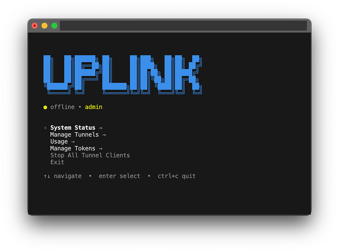

# Uplink CLI

Share your local app with others for demos, testing, review, and quick feedback — without deploying.



## Key features
- **Expose any local port**: Turn `localhost:<port>` into a public HTTPS URL like `https://abc123.x.uplink.spot`
- **Agent-first**: Works well with Cursor, Claude Code, Codex, Windsurf (and other agentic tools)
- **Terminal-native**: Start/stop tunnels and manage URLs from an interactive menu
- **No browser required**: Create an account + token from the CLI (`uplink signup`), then automate everything
- **Open source CLI**: Inspect, extend, and contribute

## Why use Uplink
- **Fastest way to share localhost**: Great for “can you look at this?” moments
- **Works great with agents**: machine-readable `--json`, stable exit codes, and stdin token support
- **Share links + optional permanent URLs**: Permanent URLs are available if enabled on your account

Learn more at [uplink.spot](https://uplink.spot)

## Install
```bash
npm install -g uplink-cli
# or
npx uplink-cli --help
```

## Authenticate (no browser)
```bash
uplink signup --json                     # creates account + token
# or interactive: uplink (Get Started)
export AGENTCLOUD_TOKEN=your-token-here  # save securely
```

## Quick start (interactive)
```bash
uplink        # open menu
```
- Start Tunnel → pick or enter port → get URL (e.g., https://abc123.x.uplink.spot)
- My Tunnels → see status and permanent URL if set
- Create Permanent URL → pick tunnel → enter alias (if premium enabled)

### Hosting (interactive)
- Hosting → Setup Wizard → analyze + create + deploy
- Hosting → Deploy to Existing App → select app with arrow keys
- Hosting → List Hosted Apps → select app to view ID + URL
- Hosting → Delete Hosted App → select app, confirm options (type `DELETE` to proceed)

## Quick start (non-interactive)
```bash
# Create tunnel (any port: 3000, 8080, 5173, etc.)
echo "$AGENTCLOUD_TOKEN" | uplink --token-stdin tunnel create --port 3000 --json

# List tunnels
echo "$AGENTCLOUD_TOKEN" | uplink --token-stdin tunnel list --json

# Set alias (if enabled on account)
echo "$AGENTCLOUD_TOKEN" | uplink --token-stdin tunnel alias-set --id tun_xxx --alias myapp --json
```

## Agent essentials
- **`--json`**: stdout = JSON only; stderr = logs/errors
- **`--token-stdin`**: read token once from stdin (avoid argv leaks)
- **`--api-base`**: override API host if needed
- **Exit codes**: 0 ok; 2 usage; 10 auth missing/invalid; 20 network; 30 server/unknown  
See `docs/AGENTS.md` for the full contract.

## Key commands
- `uplink menu` — interactive UI
- `uplink tunnel create --port <p> [--alias <a>] [--json]`
- `uplink tunnel list --json`
- `uplink tunnel alias-set --id <id> --alias <a> --json`
- `uplink tunnel alias-delete --id <id> --json`
- `uplink tunnel stats --id <id> --json`
- `uplink tunnel stop --id <id> --json`
- `uplink signup --json` — create user + token (no auth)

## Environment
```bash
export AGENTCLOUD_TOKEN=your-token
export AGENTCLOUD_API_BASE=https://api.uplink.spot
export TUNNEL_CTRL=tunnel.uplink.spot:7071
export TUNNEL_DOMAIN=x.uplink.spot
```

## Troubleshooting
- “No running tunnel clients found” — make sure the tunnel client is still running; restart `uplink` and start a tunnel.
- Auth errors — verify `AGENTCLOUD_TOKEN` is set/exported; use `--token-stdin`.
- Relay errors — ensure `TUNNEL_CTRL=tunnel.uplink.spot:7071`.

## Docs
- Menu reference: `docs/MENU_STRUCTURE.md`
- Agent guide: `docs/AGENTS.md`
- Open source CLI scope vs backend: `docs/OPEN_SOURCE_CLI.md`

## License
MIT
