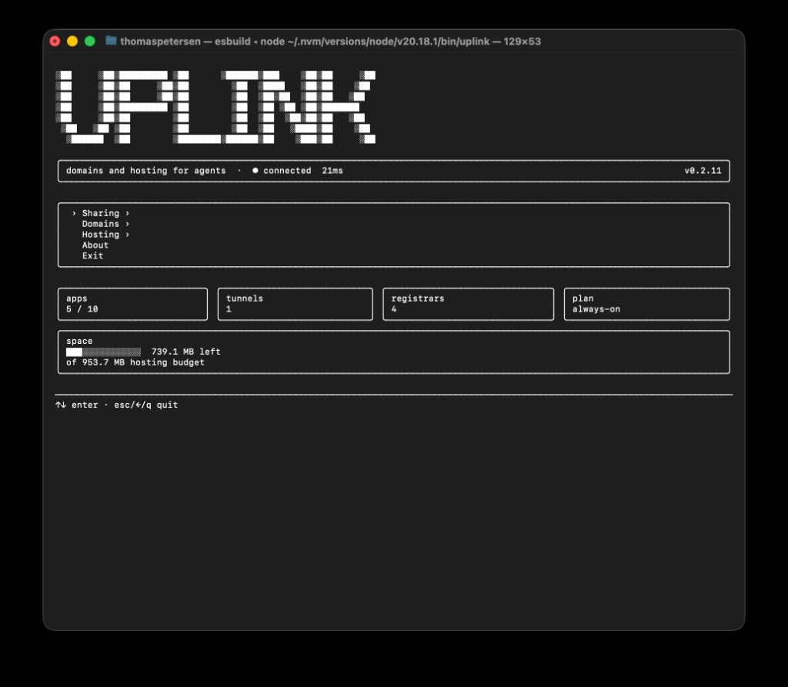

# Uplink CLI

**Software for agents** — share localhost, host apps, and attach domains from the terminal. Built for Cursor, Claude Code, Codex, Windsurf, and humans who live in a shell.



## Key features
- **Share any local port**: `localhost:<port>` → public HTTPS (`https://abc123.x.uplink.spot`)
- **Agent-first**: `--json`, stable exit codes, `--token-stdin` (no browser required)
- **Hosting**: deploy Next.js / Vite / static apps to Uplink
- **Domains**: list registrar inventory and attach custom hostnames to hosted apps
- **Interactive menu**: `uplink` for humans; CLI subcommands for agents

Learn more at [uplink.spot](https://uplink.spot)

## Install

```bash
npm install -g uplink-cli
# or
npx uplink-cli --help
```

`latest` on npm is **0.2.0** (guest login, email OTP, public `domains check`, DreamHost). Changelog: [CHANGELOG.md](./CHANGELOG.md). Product: [docs/PRODUCT.md](./docs/PRODUCT.md). Hosting: [docs/HOSTING.md](./docs/HOSTING.md).

## Start without signup
```bash
# Guest token is created and saved automatically
uplink tunnel create --port 3000 --json
```

Guest access includes one active tunnel for 24 hours and public domain search.

## Unlock persistent features
```bash
uplink login --email you@example.com
uplink login --email you@example.com --code 123456 --json
```

Email verification preserves the guest tunnel and unlocks hosting, databases, and registrar features. Aliases and custom domains still depend on the account plan.

## Quick start (agents)
```bash
# Creates guest access automatically when needed
uplink tunnel create --port 3000 --json

# List / stop
echo "$AGENTCLOUD_TOKEN" | uplink --token-stdin tunnel list --json
echo "$AGENTCLOUD_TOKEN" | uplink --token-stdin tunnel stop --id tun_xxx --json
```

Full contract: **[AGENTS.md](./AGENTS.md)** (also at `docs/AGENTS.md`).

## Quick start (interactive)
```bash
uplink        # open menu
```
- **Share** → Start tunnel → pick port → public URL
- **Hosting** → Setup / Deploy / List / Delete
- **Domains** → connect registrar, attach hostname to a hosted app

## Hosting (non-interactive)
```bash
echo "$AGENTCLOUD_TOKEN" | uplink --token-stdin host setup \
  --path . --name myapp --yes --json
```

## Domains (non-interactive)
```bash
uplink domains providers connect godaddy --token-env GODADDY_PAT --json
uplink domains list --json
echo "$AGENTCLOUD_TOKEN" | uplink --token-stdin \
  host domains add --id app_xxx --hostname example.com --json
```

## Agent essentials
- **`--json`**: stdout = JSON only; stderr = logs/errors
- **`--token-stdin`**: read token once from stdin (avoid argv leaks)
- **`--api-base`**: override API host if needed
- **Exit codes**: 0 ok · 2 usage · 10 auth · 20 network · 30 server/unknown

## Key commands
- `uplink menu` — interactive UI
- `uplink login --email <email> [--code <code>] [--json]`
- `uplink signup --json`
- `uplink tunnel create --port <p> [--alias <a>] [--json]` — starts client
- `uplink tunnel list|stats|stop|alias-set|alias-delete --json`
- `uplink host setup|deploy|list|status|logs|delete …`
- `uplink host domains add|verify|list|remove …`
- `uplink domains list|check|providers …`

## Environment
```bash
export AGENTCLOUD_TOKEN=your-token
export AGENTCLOUD_API_BASE=https://api.uplink.spot
export TUNNEL_CTRL=tunnel.uplink.spot:7071
export TUNNEL_DOMAIN=x.uplink.spot
```

## Troubleshooting
- URL not live — ensure something is listening on the port and the client started (`tunnel list` → `connected`)
- Auth errors — verify `AGENTCLOUD_TOKEN` or `~/.uplink/credentials`; prefer `--token-stdin` for agents
- Relay errors — `TUNNEL_CTRL=tunnel.uplink.spot:7071`
- Domain search TUI — not bundled on npm; use `domains list` / `check` / `host domains *`

## Docs
- Agents: [AGENTS.md](./AGENTS.md)
- Product: [docs/PRODUCT.md](./docs/PRODUCT.md)
- Hosting: [docs/HOSTING.md](./docs/HOSTING.md)
- Menu: [docs/MENU_STRUCTURE.md](./docs/MENU_STRUCTURE.md)
- Changelog: [CHANGELOG.md](./CHANGELOG.md)

## License
MIT — see [LICENSE](./LICENSE)
